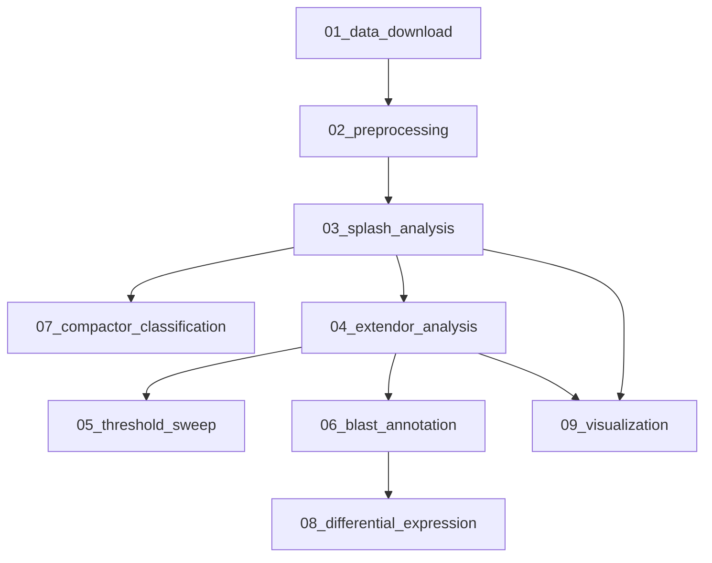

# SPLASH2 Cancer Transcriptomics Pipeline

Reference-free analysis of CPTAC/TCGA lung adenocarcinoma RNA-seq data using [SPLASH2](https://github.com/refresh-bio/SPLASH). Scripts for anchor-based tumor vs. normal analysis, BLAST annotation, compactor classification, and differential expression. Designed for HPC/SLURM environments.

## Workflow

Stages are numbered for navigation but **dependencies form a graph**, not a single linear path. After SPLASH2 output (`03`), three independent branches diverge:



- **`07_compactor_classification`** — branches directly from SPLASH2 compactor output; can target specific anchors independently of extendor work
- **`04_extendor_analysis`** → **`05_threshold_sweep`** / **`06_blast_annotation`** → **`08_differential_expression`** — anchor-level tumor/normal proportions, parameter sweep, BLAST annotation, and gene-level DE
- **`09_visualization`** — SPLASH2-author plotting tools, fed by SPLASH or extendor outputs

## Directory Structure

```
.
├── 01_data_download/
│   └── download.py                     # GDC API download script
├── 02_preprocessing/
│   ├── bam2fastq.sh / bam2fastq_reprocess.sh
│   ├── rename_bams.sh / rename_fastq.sh
│   ├── convert_to_parquet.sh
│   └── subsample.py
├── 03_splash_analysis/
│   ├── cptac_lung/                     # SPLASH2 runs (cohort A 430 & cohort B 214 samples)
│   ├── tcga_endometrial/
│   └── tcga_test/
├── 04_extendor_analysis/
│   ├── extendor_analysis.py            # Core extendor proportion analysis
│   ├── anchor_prevalence_filter.py
│   ├── filter_blast_ge2_by_anchor_prevalence.py
│   └── run_*.sh
├── 05_threshold_sweep/
│   ├── threshold_sweep.py
│   ├── run_threshold_sweep.sh / run_replot_sweep.sh
│   └── results/scatter_grid_overview.png
├── 06_blast_annotation/
│   └── scripts/                        # BLAST pipeline, result summarization
├── 07_compactor_classification/
│   ├── SPLASH2_compactor_classification.R
│   ├── run_compactor_classification.sh
│   └── splash2_scripts/               # Third-party scripts from SPLASH2 authors (GPL-3.0 / MIT)
├── 08_differential_expression/
│   ├── MMP1_DE_analysis.R
│   └── plots/
├── 09_visualization/
│   └── plotGeneration.py              # Third-party plotting script from SPLASH2 authors (GPL-3.0)
└── requirements.txt
```

## Quick Start

### Setup

```bash
git clone https://github.com/davidzeng21/splash2-cancer-transcriptomics.git
cd splash2-cancer-transcriptomics
pip install -r requirements.txt
```

### HPC modules

```bash
module load samtools blast R
```

### Typical run (cohort B — 214 samples)

```bash
# 1. Download data (requires GDC token)
export GDC_TOKEN="your_gdc_token"
python 01_data_download/download.py --manifest <manifest.txt>

# 2. Preprocess
sbatch 02_preprocessing/bam2fastq.sh

# 3. SPLASH2
./03_splash_analysis/cptac_lung/splash_cptac_v2.sh

# --- Branch A: compactor / splicing ---
sbatch 07_compactor_classification/run_compactor_classification.sh

# --- Branch B: extendor → BLAST → DE ---
sbatch 04_extendor_analysis/run_extendor_2026_02_20.sh
sbatch 06_blast_annotation/scripts/run_blast_tumor_extendors.sh
Rscript 08_differential_expression/MMP1_DE_analysis.R

# --- Branch C: visualization ---
python 09_visualization/plotGeneration.py --dsName "CPTAC_Lung" --outFolder plots/
```


## Dependencies

**Python:** pandas, numpy, matplotlib, seaborn, scipy, tqdm (see `requirements.txt`)

**R:** TCGAbiolinks, DESeq2, data.table, ggplot2, dplyr, Biostrings, GenomicAlignments, stringdist, stringr

**Bioinformatics tools:** SPLASH2, BLAST+ (`blastn`), SAMtools, STAR

## Data Sources

- **TCGA / CPTAC** RNA-seq: [NCI Genomic Data Commons](https://portal.gdc.cancer.gov/) (controlled access; GDC token required)
- **BLAST databases:** RefSeq RNA, core_nt, GRCh38.p13
- **Reference genome:** GRCh38.p14 (GENCODE v49)

## License

This repository is licensed under the **GNU General Public License v3.0** — see [LICENSE](LICENSE).

Third-party scripts under `07_compactor_classification/splash2_scripts/` and `09_visualization/plotGeneration.py` are from the [SPLASH2 project](https://github.com/refresh-bio/SPLASH) and are redistributed under their original licenses (GPL-3.0 and MIT respectively). See file headers for details.
